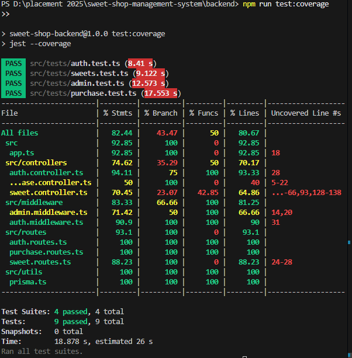
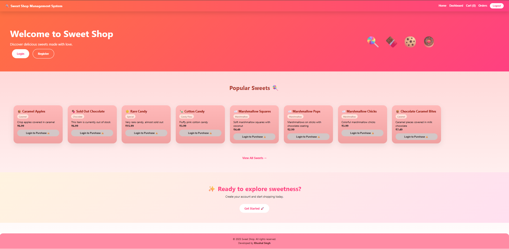
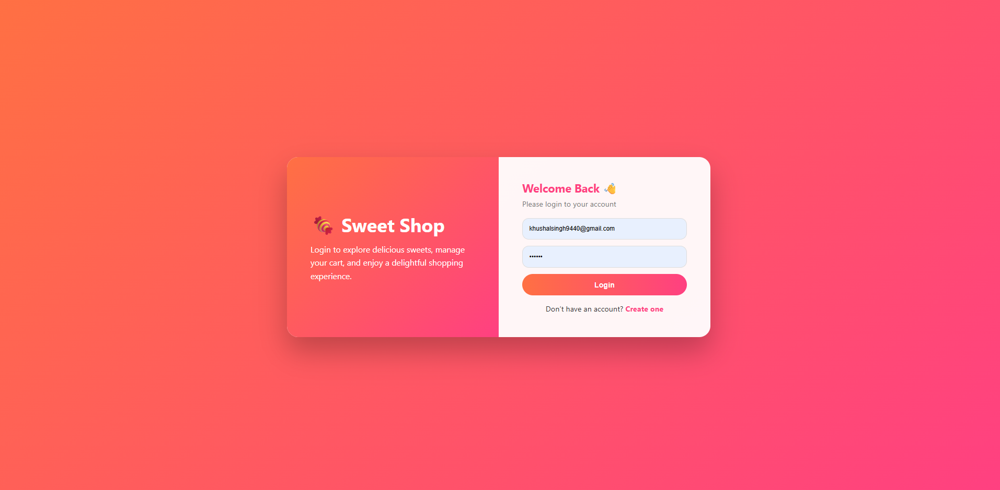
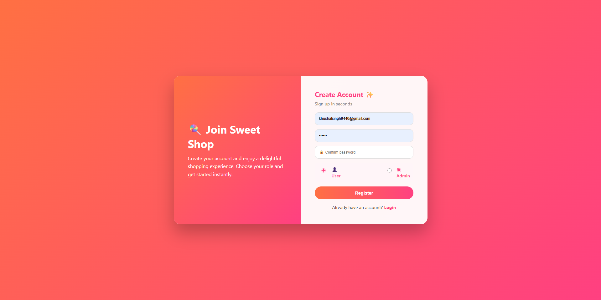
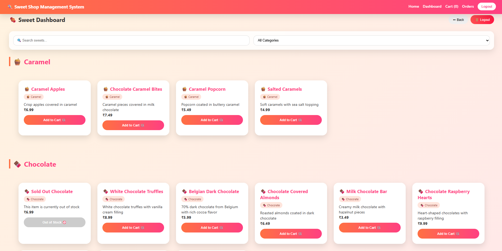
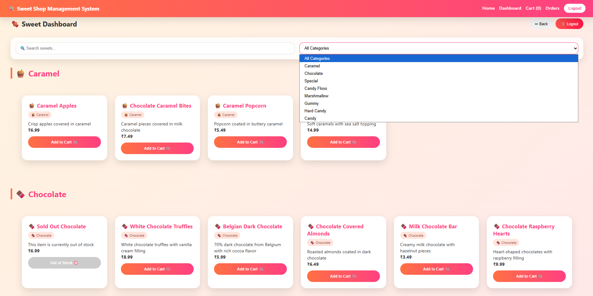
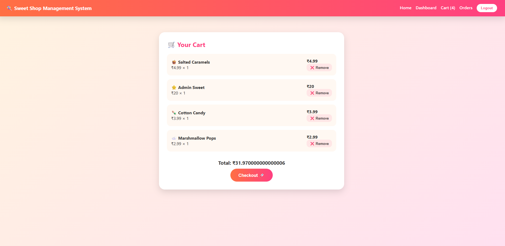
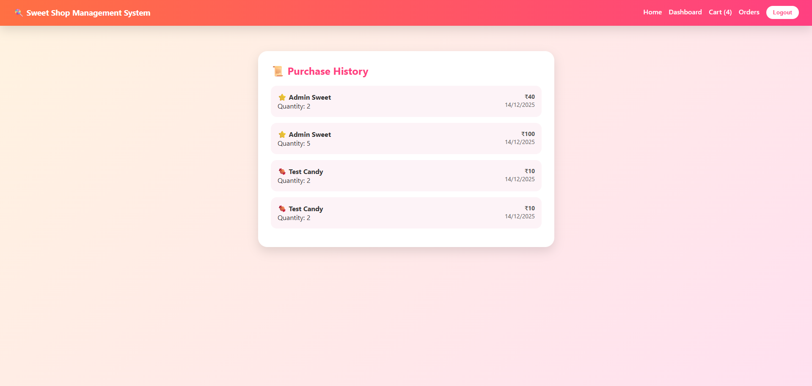
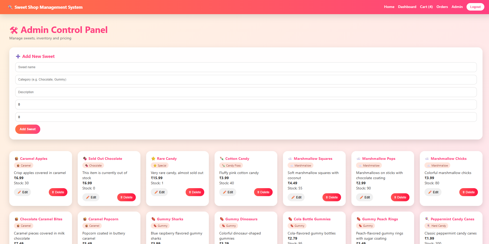

# 🍬 Sweet Shop Management System

A **full-stack Sweet Shop Management System** built with **Node.js, TypeScript, Express, Prisma, PostgreSQL, and React (Vite)**.  
This project demonstrates **clean architecture**, **role-based authentication**, **inventory management**, and **Test-Driven Development (TDD)** with real-world business logic.

---

## 📌 Project Objective

The objective of this project is to design and build a **production-ready full-stack application** that showcases:

- RESTful API design
- Secure authentication & authorization
- Database modeling using Prisma ORM
- Test-Driven Development (Red → Green → Refactor)
- Clean coding practices & SOLID principles
- Modern frontend UI/UX
- Transparent and responsible AI usage

---

## 🧠 Key Features

### 👤 Authentication & Authorization
- User registration and login
- JWT-based authentication
- Role-based access control (USER / ADMIN)
- Protected routes using middleware

### 🍭 Sweet Management
- View all available sweets
- Search & filter sweets by name, category, price
- Category-wise grouping with icons
- Stock availability tracking

### 🛒 Cart & Purchase System
- Add sweets to cart
- Checkout with quantity validation
- Atomic stock update using Prisma transactions
- Persistent purchase history

### 🛠 Admin Panel
- Add new sweets
- Update sweet details
- Delete sweets
- Restock inventory
- Admin-only secured endpoints

### 🎨 Frontend UI/UX
- Modern and responsive design
- Smooth transitions & animations
- Category-based sweet icons
- Separate dashboards for User and Admin
- Attractive Home, Login, and Register pages

---

## 🧱 Tech Stack

### Backend
- Node.js
- TypeScript
- Express.js
- Prisma ORM
- PostgreSQL
- JWT Authentication
- Jest & Supertest (Testing)

### Frontend
- React (Vite)
- TypeScript
- React Router
- Context API
- CSS animations & transitions

---

## 🗂 Project Structure
```text
sweet-shop-management-system/
├── backend/
│ ├── src/
│ │ ├── app.ts
│ │ ├── server.ts
│ │ ├── controllers/
│ │ ├── routes/
│ │ ├── middleware/
│ │ ├── utils/
│ │ └── tests/
│ ├── prisma/
│ │ ├── schema.prisma
│ │ └── seed.ts
│ ├── jest.config.js
│ ├── tsconfig.json
│ └── package.json
│
├── frontend/
│ ├── src/
│ │ ├── pages/
│ │ ├── components/
│ │ ├── context/
│ │ ├── services/
│ │ └── utils/
│ ├── vite.config.ts
│ └── package.json
│
└── README.md
```
## 🧩 Database Model (Prisma, PostgreSQL )

### User
- id
- email
- password
- role
- purchases

### Sweet
- id
- name
- category
- price
- quantity
- purchases

### PurchaseHistory
- userId
- sweetId
- quantity
- price
- total
- createdAt

Relations are enforced to maintain **data integrity**, and **transactions** are used for safe checkout operations.

---

## 🧪 Test-Driven Development (TDD)

This project follows the **Red → Green → Refactor** approach.

### 🔴 Red
- Wrote failing tests for:
  - Invalid purchase quantity
  - Insufficient stock
  - Unauthorized access
  - Admin-only operations

### 🟢 Green
- Implemented minimal logic to pass tests:
  - Input validation
  - Inventory checks
  - Role-based middleware
  - Prisma transactions

### 🔵 Refactor
- Improved readability and naming
- Removed duplicate logic
- Cleaned controller responsibilities

---

## 🧪 Testing Setup

### Tools Used
- Jest
- Supertest
- Prisma Client

### Covered Areas
- Authentication APIs
- Sweet APIs
- Purchase & checkout flow
- Admin operations

### 🧪 Testing & Quality Assurance
The backend is built using **Test Driven Development (TDD)** principles. 
Below is the coverage report showing high test coverage across controllers, middleware, and routes.



## 📸 Screenshots

### 🏠 Landing & Authentication
The application features a responsive landing page and a secure authentication system allowing users to register as either a standard User or an Admin.
###Home page.
 


| Login | Register |
|:---:|:---:|
|  |  |

### 🛍️ User Dashboard & Shopping Experience
Users can browse sweets, filter by specific categories (e.g., Caramel, Chocolate, Gummy), search for items, and manage their shopping cart.

**Dashboard & Filtering**



**Cart & Checkout**
Users can view selected items, modify quantities, and see the calculated total before checking out.


**Order History**
A record of previous purchases is maintained for the user.


### ⚙️ Admin Control Panel
Admins have access to a dedicated panel to manage inventory. Features include adding new sweets, updating stock/pricing, and deleting items (CRUD operations).



